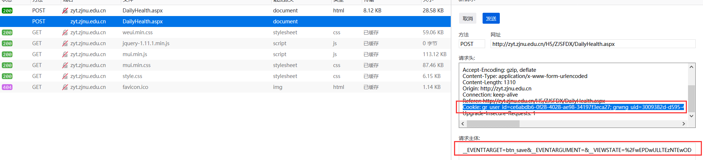

### 浙师大战疫通信息直报系统每日健康打卡脚本

- 打卡URL：http://zyt.zjnu.edu.cn/H5/ZJSFDX/DailyHealth.aspx
- 使用步骤

打开控制台，提交一次请求，通过控制台网络选项获取cookie和请求主体



添加到main.py中，部署到vps上，并使用crontab -e命令添加计划任务，例如

```
2 0 * * * python /root/main.py >> /root/main.py.log 2>&1

### 
2>&1的意思是把错误的输出也输出到标准输出（2表示错误，2>表示错误输出，&表示等同于，1表示正确），因此如果运行出错也会把错误输出到之前定义的log中。
```

第二天可以查看log.txt获得是否打卡成功

参考资料：

>https://blog.csdn.net/haitaolang/article/details/79783452

